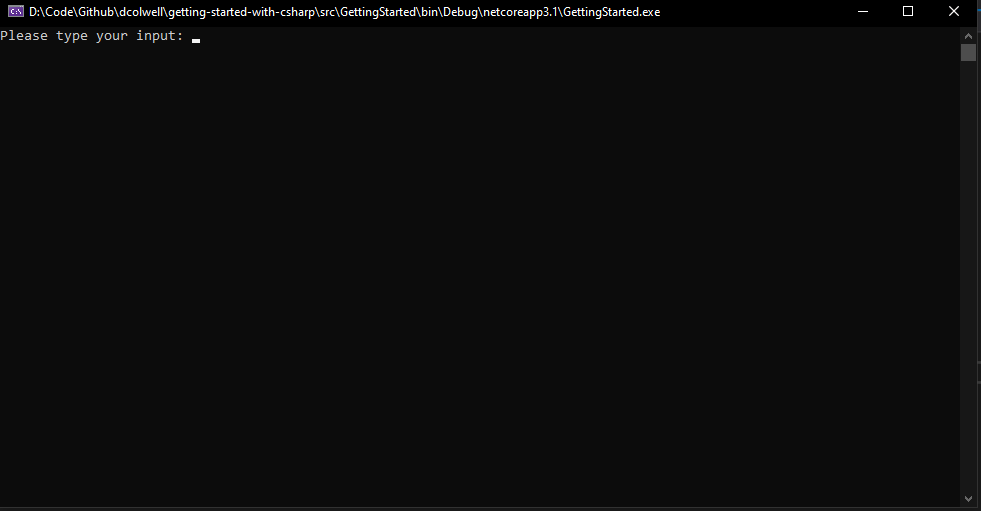

# Getting Started
## Download Prerequisites
1. Download Visual Studio (you can use the community edition if you dont have a licence) [download link here](https://visualstudio.microsoft.com/vs/community/)
2. Open Visual Studio and ensure you have the C# and Cross platform development plugins installed 
3. [Download Git](https://git-scm.com/downloads) for your platform 
4. Download Excel, or any other tool that will let you edit CSV files

## Downloading the Code
1. Create a directory somewhere on your machine
2. Open command line in that directory
3. Clone this repository using the command `git clone https://github.com/d-colwell/getting-started-with-csharp`
4. There should be a directory called 'getting-started-with-csharp', containing this readme file, and a directory `src` with the code in it
5. Open the `GettingStarted.sln` solution file, and Build the solution
6. Run the code (shortcut key is F5), you should see this display 

 

## Your task
Read the comments located in [Program.cs](./src/GettingStarted/Program.cs). Your job is to read the csv file included ('sample.csv'). It contains a record containing the values `hello` and `world`. 

when the user types in 'hello' in the console, your program should read through the CSV file and find the record where the first value is 'Hello'. It should then print out the second value for that record.

You will know you are successful if the console writes back out the phrase 'World'
